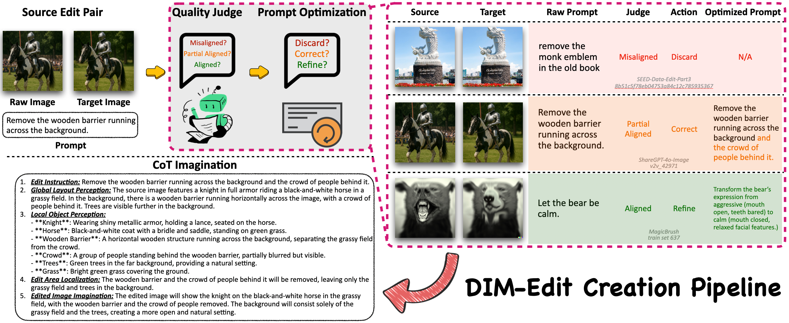
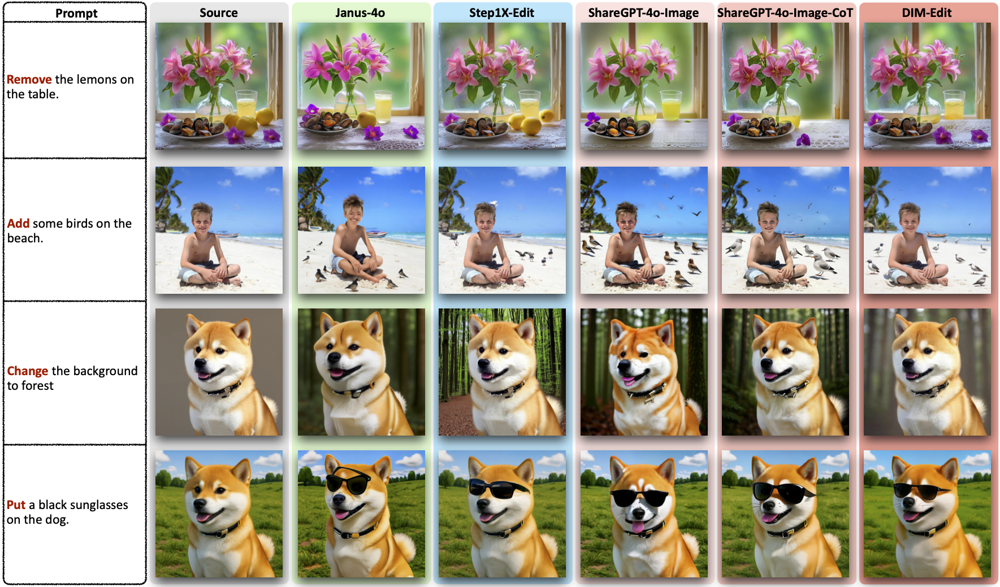
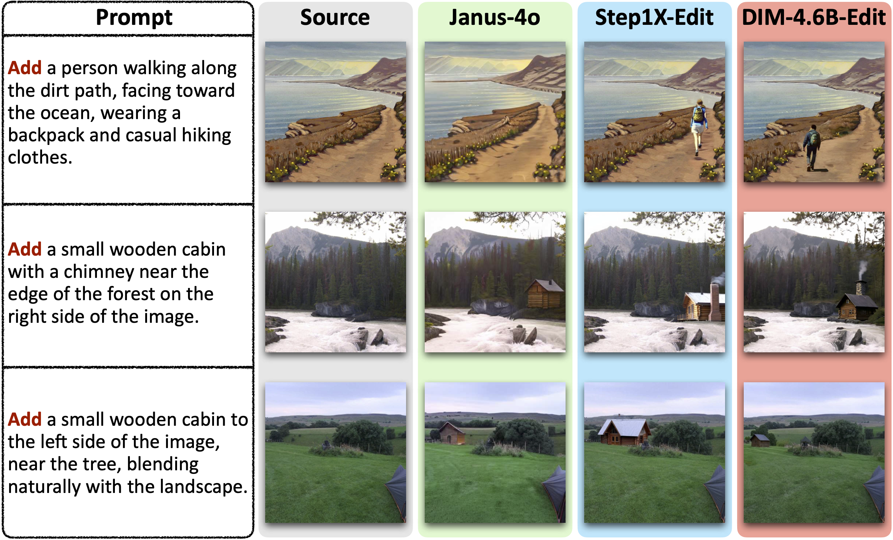
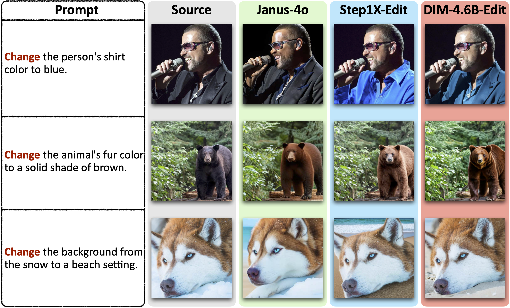
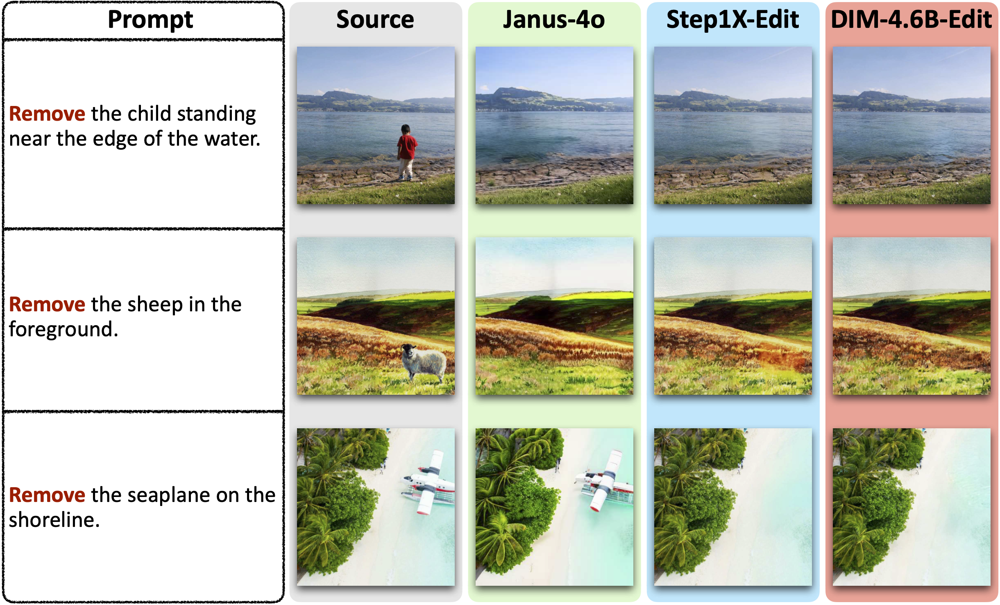
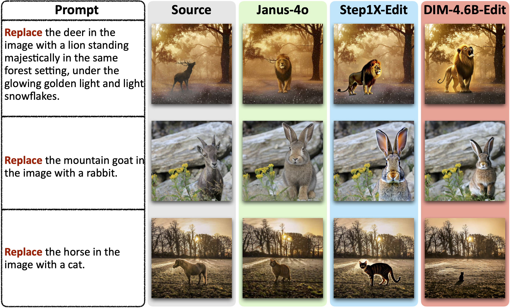

# [ICLR 2026] Draw-In-Mind: Rebalancing Designer-Painter Roles in Unified Multimodal Models Benefits Image Editing

[Ziyun Zeng](https://stdkonjac.icu/), [David Junhao Zhang](https://junhaozhang98.github.io/), Wei Li,
and [Mike Zheng Shou](https://cde.nus.edu.sg/ece/staff/shou-zheng-mike/)

[](https://arxiv.org/abs/2509.01986)
[](https://showlab.github.io/DIM/)
[](https://github.com/showlab/DIM)
[](https://huggingface.co/datasets/stdKonjac/DIM-Edit)
[](https://huggingface.co/datasets/stdKonjac/DIM-T2I)
[](https://huggingface.co/stdKonjac/DIM-4.6B-Edit)
[](https://huggingface.co/stdKonjac/DIM-4.6B-T2I)



## 📰 News

- **`[2026-05-12]`** The **DIM** [project page](https://showlab.github.io/DIM/) is available.
- **`[2026-01-26]`** 🎉 **DIM** is accepted to **ICLR 2026**!
- **`[2025-10-08]`** 🚀 Released the **DIM-Edit** dataset and the **DIM-4.6B-T2I** / **DIM-4.6B-Edit** models.
- **`[2025-09-02]`** 📝 The **DIM** paper is released on arXiv.

## 🌟 Highlights

- 🧠 **Rebalanced architecture**: Let the understanding module be the *designer*, while the generation module focuses on
  *painting*.
- 📚 **Two complementary datasets**: **DIM-T2I** (long-context T2I pairs) and **DIM-Edit** (CoT imaginations from
  GPT-4o).
- ⚡ **Lightweight & efficient**: A ❄️frozen 3.0B VLM and a 🔥trainable 1.6B DiT connected via a single MLP (4.6B params
  in total).
- 🏆 **SOTA-competitive**: DIM-4.6B-Edit matches or surpasses much larger models on **ImgEdit** and **GEdit-Bench**.

## 💡 Introduction

Unified models achieve strong results in text-to-image generation but remain weak in precise editing. This limitation
arises from an *imbalanced division of responsibilities*. The understanding module is usually treated as a translator
that encodes instructions into conditions, while the generation module must act as both **designer** and **painter**.
The
result is that the generation module carries too much responsibility, even though it is not optimized for complex
reasoning.

To address this, we introduce **Draw-In-Mind (DIM)**, a dataset with two complementary parts:

- 🖼️ **DIM-T2I**: Millions of long-context image–text pairs that strengthen instruction comprehension.
- ✏️ **DIM-Edit**: 233K chain-of-thought imaginations from GPT-4o that provide explicit design blueprints.

We connect a frozen **Qwen2.5-VL-3B** with a trainable **SANA1.5-1.6B** via a lightweight MLP, forming
**DIM-4.6B-T2I/Edit**. With this setup, the understanding module takes on the *designer responsibility*, while the
generation module focuses on rendering. Despite its modest size, DIM-4.6B-Edit achieves SOTA or competitive results on
**ImgEdit** and **GEdit-Bench**, outperforming much larger models.

## 📊 Performance

<details>
<summary><b>📈 GenEval & MJHQ-30K</b></summary>

> <sup>†</sup> denotes using an LLM rewriter. For MJHQ(-30K), we report FID.

| Model                                                          |      Params      | Sin. | Two  | CT.  | Colors | Pos. | Attr. | Overall |   MJHQ   |
|----------------------------------------------------------------|:----------------:|:----:|:----:|:----:|:------:|:----:|:-----:|:-------:|:--------:|
| <tr><td colspan="10" align="center"><b>Gen. Only</b></td></tr> |
| PixArt-α                                                       |      0.6B🔥      | 0.98 | 0.50 | 0.44 |  0.80  | 0.08 | 0.07  |  0.48   |   6.14   |
| SDXL                                                           |      2.6B🔥      | 0.98 | 0.74 | 0.39 |  0.85  | 0.15 | 0.23  |  0.55   |   8.76   |
| DALL-E·3                                                       |        -         | 0.96 | 0.87 | 0.47 |  0.83  | 0.43 | 0.45  |  0.67   |    -     |
| SD3-Medium                                                     |      2.0B🔥      | 0.99 | 0.94 | 0.72 |  0.89  | 0.33 | 0.60  |  0.74   |  11.92   |
| <tr><td colspan="10" align="center"><b>Unified</b></td></tr>   |
| Janus                                                          |      1.3B🔥      | 0.97 | 0.68 | 0.30 |  0.84  | 0.46 | 0.42  |  0.61   |  10.10   |
| Emu3-Gen<sup>†</sup>                                           |      8.0B🔥      | 0.99 | 0.81 | 0.42 |  0.80  | 0.49 | 0.45  |  0.66   |    -     |
| Show-o                                                         |      1.3B🔥      | 0.98 | 0.80 | 0.66 |  0.84  | 0.31 | 0.50  |  0.68   |  15.18   |
| Show-o2-7B                                                     |      7.0B🔥      | 1.00 | 0.87 | 0.58 |  0.92  | 0.52 | 0.62  |  0.76   |    -     |
| Janus-Pro-7B                                                   |      7.0B🔥      | 0.99 | 0.89 | 0.59 |  0.90  | 0.79 | 0.66  |  0.80   |  13.48   |
| BAGEL                                                          |     14.0B🔥      | 0.99 | 0.94 | 0.81 |  0.88  | 0.64 | 0.63  |  0.82   |    -     |
| MetaQuery-L<sup>†</sup>                                        | 3.0B❄️ \| 3.2B🔥 |  -   |  -   |  -   |   -    |  -   |   -   |  0.78   |   6.35   |
| **DIM-4.6B-T2I<sup>†</sup>**                                   | 3.0B❄️ \| 1.6B🔥 | 0.99 | 0.89 | 0.63 |  0.86  | 0.62 | 0.61  |  0.77   | **5.50** |

</details>

<details>
<summary><b>🖌️ ImgEdit Overall</b></summary>

> Q3/7B indicates using Qwen2.5-VL-3/7B as the external designer during inference. By default, GPT-4o is employed
> as the external designer to ensure the best performance. All models are evaluated using GPT-4.1.

| Model             | Add  | Adj. | Ext. | Rep. | Rem. | Back. | Sty. | Hyb. | Act. | Overall  |
|-------------------|:----:|:----:|:----:|:----:|:----:|:-----:|:----:|:----:|:----:|:--------:|
| MagicBrush        | 2.84 | 1.58 | 1.51 | 1.97 | 1.58 | 1.75  | 2.38 | 1.62 | 1.22 |   1.83   |
| Instruct-P2P      | 2.45 | 1.83 | 1.44 | 2.01 | 1.50 | 1.44  | 3.55 | 1.20 | 1.46 |   1.88   |
| AnyEdit           | 3.18 | 2.95 | 1.88 | 2.47 | 2.23 | 2.24  | 2.85 | 1.56 | 2.65 |   2.45   |
| UltraEdit         | 3.44 | 2.81 | 2.13 | 2.96 | 1.45 | 2.83  | 3.76 | 1.91 | 2.98 |   2.70   |
| Step1X-Edit       | 3.88 | 3.14 | 1.76 | 3.40 | 2.41 | 3.16  | 4.63 | 2.64 | 2.52 |   3.06   |
| BAGEL             | 3.56 | 3.31 | 1.70 | 3.30 | 2.62 | 3.24  | 4.49 | 2.38 | 4.17 |   3.20   |
| UniWorld-V1       | 3.82 | 3.64 | 2.27 | 3.47 | 3.24 | 2.99  | 4.21 | 2.96 | 2.74 |   3.26   |
| Janus-4o          | 3.35 | 3.35 | 2.25 | 3.01 | 2.18 | 3.32  | 4.71 | 2.49 | 4.04 |   3.19   |
| GPT-4o-Image      | 4.61 | 4.33 | 2.90 | 4.35 | 3.66 | 4.57  | 4.93 | 3.96 | 4.89 |   4.20   |
| **DIM-4.6B-Edit** | 4.09 | 3.47 | 2.30 | 4.00 | 3.43 | 3.87  | 4.92 | 2.85 | 4.08 | **3.67** |

</details>

<details>
<summary><b>🔬 ImgEdit Designer Ablation</b></summary>

> <sup>†</sup> The default setting.

| Designer           | Add  | Adj. | Ext. | Rep. | Rem. | Back. | Sty. | Hyb. | Act. | Overall  |
|:-------------------|:----:|:----:|:----:|:----:|:----:|:-----:|:----:|:----:|:----:|:--------:|
| –                  | 3.53 | 3.23 | 2.01 | 3.49 | 1.47 | 3.42  | 4.79 | 2.35 | 3.64 |   3.10   |
| Qwen2.5-VL-3B      | 3.80 | 3.24 | 2.03 | 3.89 | 3.21 | 3.52  | 4.92 | 2.71 | 4.05 |   3.49   |
| Qwen2.5-VL-7B      | 3.95 | 3.35 | 2.25 | 3.85 | 3.31 | 3.57  | 4.88 | 2.81 | 4.02 |   3.55   |
| MiMo-VL-7B         | 3.95 | 3.32 | 2.20 | 3.75 | 2.46 | 3.82  | 4.88 | 2.52 | 3.93 |   3.43   |
| InternVL3.5-8B     | 3.98 | 3.40 | 2.05 | 4.14 | 3.30 | 3.84  | 4.94 | 2.77 | 3.89 |   3.59   |
| GLM-4.1V-9B        | 3.95 | 3.27 | 2.23 | 3.90 | 2.64 | 3.81  | 4.92 | 2.23 | 4.02 |   3.44   |
| GPT-4o<sup>†</sup> | 4.09 | 3.47 | 2.30 | 4.00 | 3.43 | 3.87  | 4.92 | 2.85 | 4.08 | **3.67** |

</details>

<details>
<summary><b>🖼️ Qualitative Visualization</b></summary>

> 🟢 **Green** and 🔵 **Blue** denote the edits of *Janus-4o* and *Step1X-Edit* respectively;
> 🔴 **Red** denotes the edits of our models trained on different data corpora.








</details>

## 📦 Dataset

### DIM-Edit

**Step 1.** Download [**DIM-Edit**](https://huggingface.co/datasets/stdKonjac/DIM-Edit) from our 🤗 HF repo using
the `hf` CLI:

```bash
# 1. Install the huggingface_hub library (>= 0.32.0 for hf_xet support)
pip install -U huggingface_hub

# 2. Log in with your Hugging Face account token
hf auth login

# 3. Download the dataset
hf download stdKonjac/DIM-Edit --repo-type dataset --local-dir ./DIM-Edit
```

**Step 2.** Merge and extract the split archives:

```bash
cd DIM-Edit
cat images.tar.gz.part* > images.tar.gz
tar -xvzf images.tar.gz
```

**Step 3.** Each line of `tos_dataset_edit.jsonl` corresponds to a single sample with four fields:

| Field               | Description                                                                       |
|:--------------------|:----------------------------------------------------------------------------------|
| `id`                | Unique identifier for each sample.                                                |
| `image_path`        | Path to the **source** image, beginning with `image/`.                            |
| `image_path_target` | Path to the **target** image, beginning with `image/`.                            |
| `prompt`            | The CoT-style instruction describing how to transform the source into the target. |

**Step 4.** Load the dataset with the 🤗 `datasets` library:

```python
from datasets import load_dataset, Features, Value

features = Features({
    "id": Value("string"),
    "image_path": Value("string"),
    "image_path_target": Value("string"),
    "prompt": Value("string"),
})

ds = load_dataset(
    "json",
    data_files="DIM-Edit/tos_dataset_edit.jsonl",
    features=features,
    split="train",
)

print(ds[0])
```

#### 📜 DIM-Edit License

The **DIM-Edit** dataset is released under the [CC-BY-NC 4.0](https://creativecommons.org/licenses/by-nc/4.0/) license.

### DIM-T2I

Please refer to [`T2I_DATASET.md`](https://github.com/showlab/DIM/blob/main/data/T2I_DATASET.md) for download instructions and licensing details.

## 🚀 Model

### ⚙️ Environment Setup

```bash
pip install -r requirements.txt
```

### 🦙 Model Zoo

Create a `checkpoints` folder in the root directory, then download the models from our 🤗 HF repo and move them
into `checkpoints/`.

```bash
mkdir checkpoints
```

> 💡 To facilitate reproducibility, we release [**DIM-4.6B-Edit-Stage1**](https://huggingface.co/stdKonjac/DIM-4.6B-Edit-Stage1),
> which is trained solely on the **UltraEdit** dataset. Fine-tuning this checkpoint on our proposed
> [**DIM-Edit**](https://huggingface.co/datasets/stdKonjac/DIM-Edit) dataset should reproduce
> [**DIM-4.6B-Edit**](https://huggingface.co/stdKonjac/DIM-4.6B-Edit).

| Model                                                                             |     Task      |       Training Data        | ImgEdit |   Parameters    |
|:----------------------------------------------------------------------------------|:-------------:|:--------------------------:|:-------:|:---------------:|
| [**DIM-4.6B-T2I**](https://huggingface.co/stdKonjac/DIM-4.6B-T2I)                 | Text-to-Image | DIM-T2I + 6.9M Public Data |    –    | 3.0B❄️ + 1.6B🔥 |
| [**DIM-4.6B-Edit-Stage1**](https://huggingface.co/stdKonjac/DIM-4.6B-Edit-Stage1) | Image Editing |         UltraEdit          |  2.76   | 3.0B❄️ + 1.6B🔥 |
| [**DIM-4.6B-Edit**](https://huggingface.co/stdKonjac/DIM-4.6B-Edit)               | Image Editing |    UltraEdit → DIM-Edit    |  3.67   | 3.0B❄️ + 1.6B🔥 |

Organize the checkpoints as follows:

```
DIM/
└── checkpoints/
    ├── DIM-4.6B-T2I/
    │   ├── model.safetensors
    │   └── ...
    ├── DIM-4.6B-Edit-Stage1/
    │   ├── model.safetensors
    │   └── ...
    └── DIM-4.6B-Edit/
        ├── model.safetensors
        └── ...
```

### 🔮 Inference

<details>
<summary><b>🎨 T2I Generation</b></summary>

Demo T2I instructions are provided in `cache/demo/tos_dataset_demo.jsonl`. Each line is a JSON instruction, e.g.:

```json
{
  "id": "0000",
  "image_path": "./cache/demo/edit_demo_0000.png",
  "prompt": "A yummy cupcake floating in the air dark background"
}
```

> The `image_path` is a placeholder — modify `prompt` to generate your own image.

Run:

```bash
bash scripts/demo_t2i.sh
```

Generated images will be saved to `cache/inference/demo/DIM-4.6B-T2I/{id}_gen.jpg`.

</details>

<details>
<summary><b>✂️ Image Editing</b></summary>

Demo edit instructions are provided in `cache/demo/tos_dataset_edit_demo.jsonl`. Each line looks like:

```json
{
  "id": "0",
  "image_path": "./cache/demo/edit_demo_0000.png",
  "prompt": "Remove the lemons on the table.",
  "image_path_target": "./cache/demo/edit_demo_0000.png"
}
```

`image_path` is the source image and `prompt` is the edit instruction; `image_path_target` is a placeholder.

In `infer/demo_edit.py`, use the `set_designer_gpt` API with your own key to set GPT-4o as the external designer
for optimal performance:

```python
# GPT-4o as external designer
model.set_designer_gpt(api_key=os.environ['OPENAI_API_KEY'])
```

Alternatively, use `set_designer_X` APIs for open-source VLMs (auto-downloaded to local disk):

```python
# Qwen2.5-VL as external designer
model.set_designer_qwen(version='Qwen/Qwen2.5-VL-3B-Instruct')
model.set_designer_qwen(version='Qwen/Qwen2.5-VL-7B-Instruct')

# InternVL3.5 as external designer (recommend using transformers==4.53.0)
model.set_designer_internvl(version='OpenGVLab/InternVL3_5-8B-HF')

# MiMo-VL as external designer
model.set_designer_mimo(version='XiaomiMimo/MiMo-VL-7B-RL-2508')

# GLM-4.1V as external designer (recommend using transformers==4.53.1)
model.set_designer_glm(version='THUDM/GLM-4.1V-9B-Thinking')
```

Run:

```bash
bash scripts/demo_edit.sh
```

The model first generates a CoT-guided edit instruction for each prompt
(saved to `cache/inference/demo/DIM-4.6B-Edit/tos_dataset_edit_cot_demo_gen.jsonl`),
then produces edited images at `cache/inference/demo/DIM-4.6B-Edit/{id}_edited.jpg`.

A sample GPT-4o-generated CoT jsonl is provided at `cache/demo/tos_dataset_edit_cot_demo.jsonl` for reference.

</details>

### 📜 Model License

The models are developed based on
[Qwen2.5-VL-3B-Instruct](https://huggingface.co/Qwen/Qwen2.5-VL-3B-Instruct)
(subject to the [Qwen RESEARCH LICENSE AGREEMENT](https://huggingface.co/Qwen/Qwen2.5-VL-3B-Instruct/blob/main/LICENSE))
and [SANA1.5_1.6B_1024px](https://huggingface.co/Efficient-Large-Model/SANA1.5_1.6B_1024px)
(subject to
the [NVIDIA License](https://huggingface.co/Efficient-Large-Model/SANA1.5_1.6B_1024px/blob/main/LICENSE.txt)).
We retain ownership of all intellectual property rights in and to any derivative works and modifications that we made.

## 🧪 Evaluation

<details>
<summary><b>📐 GenEval</b></summary>

We provide two evaluation jsonl files in `cache/GenEval` based on prompt type:

1. `tos_dataset.jsonl` — Original prompts.
2. `tos_dataset_rewritten.jsonl` — LLM-rewritten prompts.

> The `image_path` field is a placeholder — please replace it with a pseudo image on your local disk first.

Run:

```bash
bash scripts/eval_geneval.sh
```

Generated images will be saved to `cache/inference/DIM-4.6B-T2I/GenEval(_rewritten)`.
Follow the [GenEval official repo](https://github.com/djghosh13/geneval) for metric calculation.

</details>

<details>
<summary><b>🖼️ MJHQ-30K</b></summary>

Download [MJHQ-30K](https://huggingface.co/datasets/playgroundai/MJHQ-30K) (only `mjhq30k_imgs.zip` is needed),
extract under `cache/` as:

```
cache
└── MJHQ-30K
    ├── animals
    │   ├── {id}.jpg
    │   └── ...
    ├── art
    ├── fashion
    ├── food
    ├── indoor
    ├── landscape
    ├── logo
    ├── people
    ├── plants
    └── vehicles
```

All MJHQ-30K prompts are in `cache/MJHQ-30K/tos_dataset.jsonl`. Run:

```bash
bash scripts/eval_mjhq30k.sh
```

Generated images will be saved to `cache/inference/DIM-4.6B-T2I/MJHQ-30K`.
We use [pytorch-fid](https://github.com/mseitzer/pytorch-fid) to compute FID.

</details>

<details>
<summary><b>✏️ ImgEdit</b></summary>

Download [ImgEdit](https://huggingface.co/datasets/sysuyy/ImgEdit/tree/main) and organize under `cache/`:

```
cache
└── ImgEdit
    └── Benchmark
        ├── hard
        ├── multiturn
        └── singleturn
            ├── animal
            │   ├── {id}.jpg
            │   └── ...
            ├── architecture
            ├── clothes
            ├── compose
            ├── daily object
            ├── for_add
            ├── human
            ├── style
            ├── transport
            ├── judge_prompt.json
            └── singleturn.json
```

Four evaluation jsonl files are provided in `cache/ImgEdit`:

1. `tos_dataset_edit.jsonl` — Original prompts.
2. `tos_dataset_edit_cot.jsonl` — CoT-style prompts from GPT-4o.
3. `tos_dataset_edit_cot_Qwen2.5-VL-3B-Instruct.jsonl` — CoT-style prompts from Qwen2.5-VL-3B.
4. `tos_dataset_edit_cot_Qwen2.5-VL-7B-Instruct.jsonl` — CoT-style prompts from Qwen2.5-VL-7B.

Run:

```bash
bash scripts/eval_imgedit.sh
```

Generated images will be saved to `cache/inference/DIM-4.6B-Edit/ImgEdit`.
Follow the [ImgEdit official repo](https://github.com/PKU-YuanGroup/ImgEdit) for metric calculation.

</details>

<details>
<summary><b>📝 GEdit-Bench-EN</b></summary>

Download [GEdit-Bench](https://huggingface.co/datasets/stepfun-ai/GEdit-Bench), extract raw images, and organize under
`cache/`:

```
cache
└── GEdit-Bench
    └── input_image_raw
        ├── {id}.png
        ├── {id}.png
        ├── {id}.png
        └── ...
```

Four evaluation jsonl files are provided in `cache/GEdit-Bench`:

1. `tos_dataset_edit_en.jsonl` — Original prompts.
2. `tos_dataset_edit_en_cot.jsonl` — CoT-style prompts from GPT-4o.
3. `tos_dataset_edit_en_cot_Qwen2.5-VL-3B-Instruct.jsonl` — CoT-style prompts from Qwen2.5-VL-3B.
4. `tos_dataset_edit_en_cot_Qwen2.5-VL-7B-Instruct.jsonl` — CoT-style prompts from Qwen2.5-VL-7B.

Run:

```bash
bash scripts/eval_gedit_bench.sh
```

Generated images will be saved to `cache/inference/DIM-4.6B-Edit/GEdit-Bench`.
Follow the [GEdit-Bench official repo](https://github.com/stepfun-ai/Step1X-Edit) for metric calculation.

</details>

## 📖 Citation

If you find **DIM** useful for your research, please consider citing our paper:

```bibtex
@misc{zeng2025draw,
  title         = {Draw-In-Mind: Rebalancing Designer-Painter Roles in Unified Multimodal Models Benefits Image Editing},
  author        = {Zeng, Ziyun and Zhang, David Junhao and Li, Wei and Shou, Mike Zheng},
  year          = {2025},
  eprint        = {2509.01986},
  archivePrefix = {arXiv},
  primaryClass  = {cs.CV},
  url           = {https://arxiv.org/abs/2509.01986}
}
```