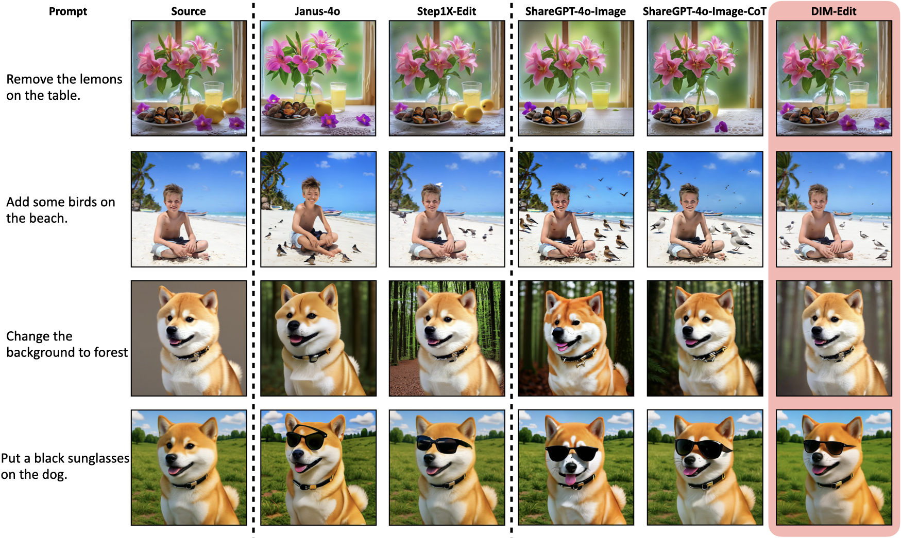

# Draw-In-Mind: Learning Precise Image Editing via Chain-of-Thought Imagination

[](https://arxiv.org/abs/2509.01986v1)
[](https://github.com/showlab/DIM)
[](https://huggingface.co/stdKonjac/DIM-4.6B-T2I)
[](https://huggingface.co/stdKonjac/DIM-4.6B-Edit)


## Introduction

Unified models achieve strong results in text-to-image generation but remain weak in precise editing. This limitation
arises from an *imbalanced division of responsibilities*. The understanding module is usually treated as a translator
that encodes instructions into conditions, while the generation module must act as both designer and painter. The result
is that the generation module carries too much responsibility, even though it is not optimized for complex reasoning.

To address this, we introduce **Draw-In-Mind (DIM)**, a dataset with two complementary parts:

- **DIM-T2I**: 14M long-context image–text pairs that strengthen instruction comprehension.
- **DIM-Edit**: 233K chain-of-thought imaginations from GPT-4o that provide explicit design blueprints.

We connect a frozen **Qwen2.5-VL-3B** with a trainable **SANA1.5-1.6B** via a lightweight MLP, forming
**DIM-4.6B-T2I/Edit**. With this setup, the understanding module takes on the *designer responsibility*, while the
generation module focuses on rendering. Despite its modest size, DIM-4.6B-Edit achieves SOTA or competitive results on
ImgEdit and GEdit-Bench, outperforming much larger models.

## Performance

<details>

<summary><b>GenEval and MJHQ-30K</b></summary>

*: <sup>†</sup> denotes using an LLM rewriter. For MJHQ(-30K), we report FID.

| Model                                                          |      Params      | Sin. | Two  | CT.  | Colors | Pos. | Attr. | Overall | MJHQ  |
|----------------------------------------------------------------|:----------------:|:----:|:----:|:----:|:------:|:----:|:-----:|:-------:|:-----:|
| <tr><td colspan="10" align="center"><b>Gen. Only</b></td></tr> |
| PixArt-α                                                       |      0.6B🔥      | 0.98 | 0.50 | 0.44 |  0.80  | 0.08 | 0.07  |  0.48   | 6.14  |
| SDXL                                                           |      2.6B🔥      | 0.98 | 0.74 | 0.39 |  0.85  | 0.15 | 0.23  |  0.55   | 8.76  |
| DALL-E·3                                                       |        -         | 0.96 | 0.87 | 0.47 |  0.83  | 0.43 | 0.45  |  0.67   |   -   |
| SD3-Medium                                                     |      2.0B🔥      | 0.99 | 0.94 | 0.72 |  0.89  | 0.33 | 0.60  |  0.74   | 11.92 |
| <tr><td colspan="10" align="center"><b>Unified</b></td></tr>   |
| Janus                                                          |      1.3B🔥      | 0.97 | 0.68 | 0.30 |  0.84  | 0.46 | 0.42  |  0.61   | 10.10 |
| Emu3-Gen<sup>†</sup>                                           |      8.0B🔥      | 0.99 | 0.81 | 0.42 |  0.80  | 0.49 | 0.45  |  0.66   |   -   |
| Show-o                                                         |      1.3B🔥      | 0.98 | 0.80 | 0.66 |  0.84  | 0.31 | 0.50  |  0.68   | 15.18 |
| Show-o2-7B                                                     |      7.0B🔥      | 1.00 | 0.87 | 0.58 |  0.92  | 0.52 | 0.62  |  0.76   |   -   |
| Janus-Pro-7B                                                   |      7.0B🔥      | 0.99 | 0.89 | 0.59 |  0.90  | 0.79 | 0.66  |  0.80   | 13.48 |
| BAGEL                                                          |     14.0B🔥      | 0.99 | 0.94 | 0.81 |  0.88  | 0.64 | 0.63  |  0.82   |   -   |
| MetaQuery-L<sup>†</sup>                                        | 3.0B❄️ \| 3.2B🔥 |  -   |  -   |  -   |   -    |  -   |   -   |  0.78   | 6.35  |
| **DIM-4.6B-T2I<sup>†</sup>**                                   | 3.0B❄️ \| 1.6B🔥 | 0.99 | 0.89 | 0.63 |  0.86  | 0.62 | 0.61  |  0.77   | 5.50  |

</details>

<details>

<summary><b>ImgEdit</b></summary>

*: Q3/7B indicates using Qwen2.5-VL-3/7B as the external designer during inference. By default, GPT-4o is employed
as the external designer to ensure the best performance. All models are evaluated using GPT-4.1.

| Model                 | Add  | Adj. | Ext. | Rep. | Rem. | Back. | Sty. | Hyb. | Act. | Overall |
|-----------------------|:----:|:----:|:----:|:----:|:----:|:-----:|:----:|:----:|:----:|:-------:|
| MagicBrush            | 2.84 | 1.58 | 1.51 | 1.97 | 1.58 | 1.75  | 2.38 | 1.62 | 1.22 |  1.83   |
| Instruct-P2P          | 2.45 | 1.83 | 1.44 | 2.01 | 1.50 | 1.44  | 3.55 | 1.20 | 1.46 |  1.88   |
| AnyEdit               | 3.18 | 2.95 | 1.88 | 2.47 | 2.23 | 2.24  | 2.85 | 1.56 | 2.65 |  2.45   |
| UltraEdit             | 3.44 | 2.81 | 2.13 | 2.96 | 1.45 | 2.83  | 3.76 | 1.91 | 2.98 |  2.70   |
| Step1X-Edit           | 3.88 | 3.14 | 1.76 | 3.40 | 2.41 | 3.16  | 4.63 | 2.64 | 2.52 |  3.06   |
| BAGEL                 | 3.56 | 3.31 | 1.70 | 3.30 | 2.62 | 3.24  | 4.49 | 2.38 | 4.17 |  3.20   |
| UniWorld-V1           | 3.82 | 3.64 | 2.27 | 3.47 | 3.24 | 2.99  | 4.21 | 2.96 | 2.74 |  3.26   |
| Janus-4o              | 3.35 | 3.35 | 2.25 | 3.01 | 2.18 | 3.32  | 4.71 | 2.49 | 4.04 |  3.19   |
| GPT-4o-Image          | 4.61 | 4.33 | 2.90 | 4.35 | 3.66 | 4.57  | 4.93 | 3.96 | 4.89 |  4.20   |
| **DIM-4.6B-Edit-Q3B** | 3.80 | 3.24 | 2.03 | 3.89 | 3.21 | 3.52  | 4.92 | 2.71 | 4.05 |  3.49   |
| **DIM-4.6B-Edit-Q7B** | 3.95 | 3.35 | 2.25 | 3.85 | 3.31 | 3.57  | 4.88 | 2.81 | 4.02 |  3.55   |
| **DIM-4.6B-Edit**     | 4.09 | 3.47 | 2.30 | 4.00 | 3.43 | 3.87  | 4.92 | 2.85 | 4.08 |  3.67   |

</details>

<details>

<summary><b>Visualization</b></summary>

*：**Left** are the editing results of Janus-4o and Step1X-Edit; **Right** are the editing results of our models trained
on different data corpora. The source images are AI-generated to strictly ensure out-of-domain testing.



</details>

## Open-Source Plan
The dataset and models are ready for release, subject to final approval, which may take several weeks. Please stay tuned. In the meantime, if you have any inquiries, you are welcome to open an issue in this repository :)

- [x] DIM paper  
- [ ] DIM-4.6B-T2I
- [ ] DIM-4.6B-Edit  
- [ ] DIM-Edit Data
- [ ] DIM-T2I Data

## Dataset Usage (TBD)

Coming soon...

## Model Usage (TBD)

### Environment Setup

Run the following script to set up the Python environment.

```
pip install -r requirements.txt
```

### 🦙 Model Zoo

Please first create a  `checkpoints` folder in the root directory:

```
mkdir checkpoints
```

Then download the models from our 🤗HF repo below, and move them to the `checkpoints` folder.

|       Model       |           Task           |   Parameters    |                                                                Link                                                                |
|:-----------------:|:------------------------:|:---------------:|:----------------------------------------------------------------------------------------------------------------------------------:|
| **DIM-4.6B-T2I**  | Text-to-Image Generation | 3.0B❄️ + 1.6B🔥 | [](https://huggingface.co/stdKonjac/DIM-4.6B-T2I) |
| **DIM-4.6B-Edit** |      Image Editing       | 3.0B❄️ + 1.6B🔥 | [](https://huggingface.co/stdKonjac/DIM-4.6B-Edit) |

The checkpoints should be organized like:

```
DIM/
└── checkpoints/
    ├── DIM-4.6B-T2I/
    │   ├── model.safetensors
    │   └── ...
    └── DIM-4.6B-Edit/
        ├── model.safetensors
        └── ...
```

### Inference

<details>

<summary><b>T2I Generation</b></summary>

The demo T2I instructions are provided in `cache/demo/tos_dataset_demo.jsonl`, where each line is an instruction in json
format like:

```
{"id": "0000", "image_path": "./cache/demo/edit_demo_0000.png", "prompt": "A yummy cupcake floating in the air dark background"}
```

The `image_path` is just a placeholder, and you can modify `prompt` to create your own image.

To generate images from the jsonl file, run the following script:

```
bash scripts/demo_t2i.sh
```

For each instruction, the generated image will be saved at `cache/inference/demo/DIM-4.6B-T2I/{id}_gen.jpg`.

</details>

<details>

<summary><b>Image Editing</b></summary>

The demo edit instructions are provided in `cache/demo/tos_dataset_edit_demo.jsonl`, where each line is an instruction
in json
format like:

```
{"id": "0", "image_path": "./cache/demo/edit_demo_0000.png", "prompt": "Remove the lemons on the table.", "image_path_target": "./cache/demo/edit_demo_0000.png"}
```

The `image_path` corresponds to the source image, and the `prompt` is the edit instruction. The `image_path_target` is
just a placeholder.

In `infer/demo_edit.py`, use the `set_designer_gpt` API with your own key to set GPT-4o as the external designer for
optimal performance.

```
model.set_designer_gpt(api_key='') # DIM-4.6B-Edit
```

You can also use the `set_designer_qwen` API to set Qwen2.5-VL-XB as the external designer. Qwen models will be
automatically
downloaded
to local disk.

```
model.set_designer_qwen(version='Qwen/Qwen2.5-VL-3B-Instruct') # DIM-4.6B-Edit-Q3B
model.set_designer_qwen(version='Qwen/Qwen2.5-VL-7B-Instruct') # DIM-4.6B-Edit-Q7B
```

To generate edited images from the jsonl file, run the following script:

```
bash scripts/demo_edit.sh
```

The model will first generate a CoT-guided edit instruction for each prompt and save it to
`cache/inference/demo/DIM-4.6B-Edit/tos_dataset_edit_cot_demo_gen.jsonl`. Then the generated images will be saved at
`cache/inference/demo/DIM-4.6B-Edit/{id}_edited.jpg`.

We also provide a sample GPT-4o generated CoT jsonl file at `cache/demo/tos_dataset_edit_cot_demo.jsonl` for reference.

</details>

### Evaluation

<details>

<summary><b>GenEval</b></summary>

We provide two evaluation jsonl files according to prompt types in `cache/GenEval`:

1. `tos_dataset.jsonl`: Origin prompts.
2. `tos_dataset_rewritten.jsonl`: LLM-rewritten prompts.

The `image_path` field in each line of the jsonl is just a
placeholder, please replace it with a pseudo image on your local disk first.

Run the following script to generate images:

```
bash scripts/eval_geneval.sh
```

The generated images will be saved to `cache/inference/DIM-4.6B-T2I/GenEval(_rewritten)`.
Please follow the guide in [GenEval](https://github.com/djghosh13/geneval) official repo for metrics calculation.

</details>

<details>

<summary><b>MJHQ-30K</b></summary>

First download [MJHQ-30K](https://huggingface.co/datasets/playgroundai/MJHQ-30K) from the HF repo. You only need to
download `mjhq30k_imgs.zip`. Then extract all images in
the `cache` folder and organize them as follows:

```
cache
└── MJHQ-30K
    ├── animals
    │   ├── {id}.jpg
    │   ├── {id}.jpg
    │   └── ...
    ├── art
    ├── fashion
    ├── food
    ├── indoor
    ├── landscape
    ├── logo
    ├── people
    ├── plants
    └── vehicles
```

We have provided all prompts of MJHQ-30K in `cache/MJHQ-30K/tos_dataset.jsonl`. Run the following script to
generate images:

```
bash scripts/eval_mjhq30k.sh
```

The generated images will be saved to `cache/inference/DIM-4.6B-T2I/MJHQ-30K`. We
use [pytorch-fid](https://github.com/mseitzer/pytorch-fid) to calculate the FID on MJHQ-30K.

</details>

<details>

<summary><b>ImgEdit</b></summary>

First download [ImgEdit](https://huggingface.co/datasets/sysuyy/ImgEdit/tree/main) from the HF repo. Put the dataset in
the `cache` folder, and organize it as follows:

```
cache
└── ImgEdit
    └── Benchmark
        ├── hard
        ├── multiturn
        └── singleturn
            ├── animal
            │   ├── {id}.jpg
            │   └── ...
            ├── architecture
            ├── clothes
            ├── compose
            ├── daily object
            ├── for_add
            ├── human
            ├── style
            ├── transport
            ├── judge_prompt.json
            └── singleturn.json
```

We provide four evaluation jsonl files according to prompt types in `cache/ImgEdit`:

1. `tos_dataset_edit.jsonl`: Origin prompts.
2. `tos_dataset_edit_cot.jsonl`: CoT-style prompts generated by GPT-4o.
3. `tos_dataset_edit_cot_Qwen2.5-VL-3B-Instruct.jsonl`: CoT-style prompts generated by Qwen2.5-VL-3B.
4. `tos_dataset_edit_cot_Qwen2.5-VL-7B-Instruct.jsonl`: CoT-style prompts generated by Qwen2.5-VL-7B.

Run the following script to generate images:

```
bash scripts/eval_imgedit.sh
```

The generated images will be saved to `cache/inference/DIM-4.6B-Edit/ImgEdit`. Please follow the guide
in [ImgEdit](https://github.com/PKU-YuanGroup/ImgEdit) official repo for metrics calculation.

</details>

<details>

<summary><b>GEdit-Bench-EN</b></summary>

First download [GEdit-Bench](https://huggingface.co/datasets/stepfun-ai/GEdit-Bench) from the HF repo. Extract all raw
images from the dataset and put them in the `cache` folder. Organize them as follows:

```
cache
└── GEdit-Bench
    └── input_image_raw
        ├── {id}.png
        ├── {id}.png
        ├── {id}.png
        ├── {id}.png
        └── ...
```

We provide four evaluation jsonl files according to prompt types in `cache/GEdit-Bench`:

1. `tos_dataset_edit_en.jsonl`: Origin prompts.
2. `tos_dataset_edit_en_cot.jsonl`: CoT-style prompts generated by GPT-4o.
3. `tos_dataset_edit_en_ot_Qwen2.5-VL-3B-Instruct.jsonl`: CoT-style prompts generated by Qwen2.5-VL-3B.
4. `tos_dataset_edit_en_cot_Qwen2.5-VL-7B-Instruct.jsonl`: CoT-style prompts generated by Qwen2.5-VL-7B.

Run the following script to generate images:

```
bash scripts/eval_gedit_bench.sh
```

The generated images will be saved to `cache/inference/DIM-4.6B-Edit/GEdit-Bench`. Please follow the guide
in [GEdit-Bench](https://github.com/stepfun-ai/Step1X-Edit) official repo for metrics calculation.

</details>