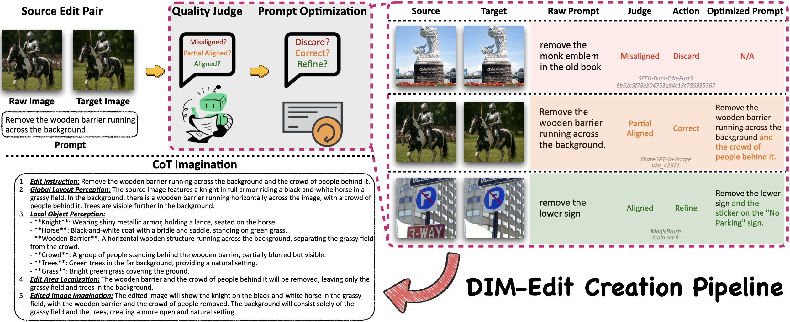
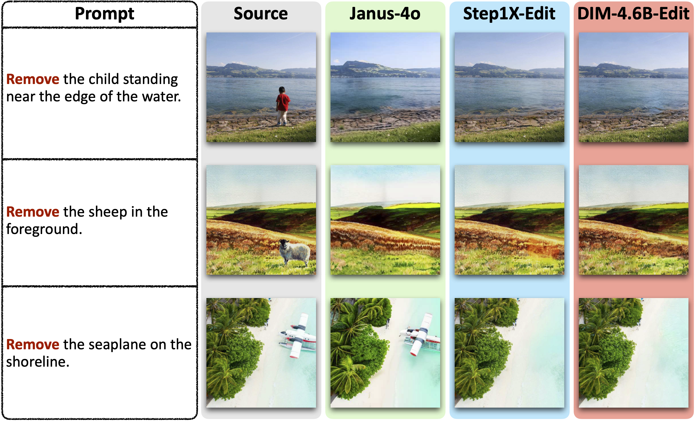

# Draw-In-Mind: Rebalancing Designer-Painter Roles in Unified Multimodal Models Benefits Image Editing

[](https://arxiv.org/abs/2509.01986)
[](https://github.com/showlab/DIM)
[](https://huggingface.co/datasets/stdKonjac/DIM-Edit)
[](https://huggingface.co/stdKonjac/DIM-4.6B-T2I)
[](https://huggingface.co/stdKonjac/DIM-4.6B-Edit)



## 📰 News

**[2025-10-08]** We release the **DIM-Edit** dataset and the **DIM-4.6B-T2I** / **DIM-4.6B-Edit** models.

**[2025-09-26]** A new version of the **DIM** paper is released, including more results across various open-source
designers.

**[2025-09-02]** The **DIM** paper is released.

## Introduction

Unified models achieve strong results in text-to-image generation but remain weak in precise editing. This limitation
arises from an *imbalanced division of responsibilities*. The understanding module is usually treated as a translator
that encodes instructions into conditions, while the generation module must act as both designer and painter. The result
is that the generation module carries too much responsibility, even though it is not optimized for complex reasoning.

To address this, we introduce **Draw-In-Mind (DIM)**, a dataset with two complementary parts:

- **DIM-T2I**: 14M long-context image–text pairs that strengthen instruction comprehension.
- **DIM-Edit**: 233K chain-of-thought imaginations from GPT-4o that provide explicit design blueprints.

We connect a frozen **Qwen2.5-VL-3B** with a trainable **SANA1.5-1.6B** via a lightweight MLP, forming
**DIM-4.6B-T2I/Edit**. With this setup, the understanding module takes on the *designer responsibility*, while the
generation module focuses on rendering. Despite its modest size, DIM-4.6B-Edit achieves SOTA or competitive results on
ImgEdit and GEdit-Bench, outperforming much larger models.

## Performance

<details>

<summary><b>GenEval and MJHQ-30K</b></summary>

*: <sup>†</sup> denotes using an LLM rewriter. For MJHQ(-30K), we report FID.

| Model                                                          |      Params      | Sin. | Two  | CT.  | Colors | Pos. | Attr. | Overall | MJHQ  |
|----------------------------------------------------------------|:----------------:|:----:|:----:|:----:|:------:|:----:|:-----:|:-------:|:-----:|
| <tr><td colspan="10" align="center"><b>Gen. Only</b></td></tr> |
| PixArt-α                                                       |      0.6B🔥      | 0.98 | 0.50 | 0.44 |  0.80  | 0.08 | 0.07  |  0.48   | 6.14  |
| SDXL                                                           |      2.6B🔥      | 0.98 | 0.74 | 0.39 |  0.85  | 0.15 | 0.23  |  0.55   | 8.76  |
| DALL-E·3                                                       |        -         | 0.96 | 0.87 | 0.47 |  0.83  | 0.43 | 0.45  |  0.67   |   -   |
| SD3-Medium                                                     |      2.0B🔥      | 0.99 | 0.94 | 0.72 |  0.89  | 0.33 | 0.60  |  0.74   | 11.92 |
| <tr><td colspan="10" align="center"><b>Unified</b></td></tr>   |
| Janus                                                          |      1.3B🔥      | 0.97 | 0.68 | 0.30 |  0.84  | 0.46 | 0.42  |  0.61   | 10.10 |
| Emu3-Gen<sup>†</sup>                                           |      8.0B🔥      | 0.99 | 0.81 | 0.42 |  0.80  | 0.49 | 0.45  |  0.66   |   -   |
| Show-o                                                         |      1.3B🔥      | 0.98 | 0.80 | 0.66 |  0.84  | 0.31 | 0.50  |  0.68   | 15.18 |
| Show-o2-7B                                                     |      7.0B🔥      | 1.00 | 0.87 | 0.58 |  0.92  | 0.52 | 0.62  |  0.76   |   -   |
| Janus-Pro-7B                                                   |      7.0B🔥      | 0.99 | 0.89 | 0.59 |  0.90  | 0.79 | 0.66  |  0.80   | 13.48 |
| BAGEL                                                          |     14.0B🔥      | 0.99 | 0.94 | 0.81 |  0.88  | 0.64 | 0.63  |  0.82   |   -   |
| MetaQuery-L<sup>†</sup>                                        | 3.0B❄️ \| 3.2B🔥 |  -   |  -   |  -   |   -    |  -   |   -   |  0.78   | 6.35  |
| **DIM-4.6B-T2I<sup>†</sup>**                                   | 3.0B❄️ \| 1.6B🔥 | 0.99 | 0.89 | 0.63 |  0.86  | 0.62 | 0.61  |  0.77   | 5.50  |

</details>

<details>

<summary><b>ImgEdit Overall</b></summary>

*: Q3/7B indicates using Qwen2.5-VL-3/7B as the external designer during inference. By default, GPT-4o is employed
as the external designer to ensure the best performance. All models are evaluated using GPT-4.1.

| Model             | Add  | Adj. | Ext. | Rep. | Rem. | Back. | Sty. | Hyb. | Act. | Overall |
|-------------------|:----:|:----:|:----:|:----:|:----:|:-----:|:----:|:----:|:----:|:-------:|
| MagicBrush        | 2.84 | 1.58 | 1.51 | 1.97 | 1.58 | 1.75  | 2.38 | 1.62 | 1.22 |  1.83   |
| Instruct-P2P      | 2.45 | 1.83 | 1.44 | 2.01 | 1.50 | 1.44  | 3.55 | 1.20 | 1.46 |  1.88   |
| AnyEdit           | 3.18 | 2.95 | 1.88 | 2.47 | 2.23 | 2.24  | 2.85 | 1.56 | 2.65 |  2.45   |
| UltraEdit         | 3.44 | 2.81 | 2.13 | 2.96 | 1.45 | 2.83  | 3.76 | 1.91 | 2.98 |  2.70   |
| Step1X-Edit       | 3.88 | 3.14 | 1.76 | 3.40 | 2.41 | 3.16  | 4.63 | 2.64 | 2.52 |  3.06   |
| BAGEL             | 3.56 | 3.31 | 1.70 | 3.30 | 2.62 | 3.24  | 4.49 | 2.38 | 4.17 |  3.20   |
| UniWorld-V1       | 3.82 | 3.64 | 2.27 | 3.47 | 3.24 | 2.99  | 4.21 | 2.96 | 2.74 |  3.26   |
| Janus-4o          | 3.35 | 3.35 | 2.25 | 3.01 | 2.18 | 3.32  | 4.71 | 2.49 | 4.04 |  3.19   |
| GPT-4o-Image      | 4.61 | 4.33 | 2.90 | 4.35 | 3.66 | 4.57  | 4.93 | 3.96 | 4.89 |  4.20   |
| **DIM-4.6B-Edit** | 4.09 | 3.47 | 2.30 | 4.00 | 3.43 | 3.87  | 4.92 | 2.85 | 4.08 |  3.67   |

</details>

<details>

<summary><b>ImgEdit Designer Ablation</b></summary>

<sup>†</sup>: The default setting.

| Designer           | Add  | Adj. | Ext. | Rep. | Rem. | Back. | Sty. | Hyb. | Act. | Overall |
|:-------------------|:----:|:----:|:----:|:----:|:----:|:-----:|:----:|:----:|:----:|:-------:|
| –                  | 3.53 | 3.23 | 2.01 | 3.49 | 1.47 | 3.42  | 4.79 | 2.35 | 3.64 |  3.10   |
| Qwen2.5-VL-3B      | 3.80 | 3.24 | 2.03 | 3.89 | 3.21 | 3.52  | 4.92 | 2.71 | 4.05 |  3.49   |
| Qwen2.5-VL-7B      | 3.95 | 3.35 | 2.25 | 3.85 | 3.31 | 3.57  | 4.88 | 2.81 | 4.02 |  3.55   |
| MiMo-VL-7B         | 3.95 | 3.32 | 2.20 | 3.75 | 2.46 | 3.82  | 4.88 | 2.52 | 3.93 |  3.43   |
| InternVL3.5-8B     | 3.98 | 3.40 | 2.05 | 4.14 | 3.30 | 3.84  | 4.94 | 2.77 | 3.89 |  3.59   |
| GLM-4.1V-9B        | 3.95 | 3.27 | 2.23 | 3.90 | 2.64 | 3.81  | 4.92 | 2.23 | 4.02 |  3.44   |
| GPT-4o<sup>†</sup> | 4.09 | 3.47 | 2.30 | 4.00 | 3.43 | 3.87  | 4.92 | 2.85 | 4.08 |  3.67   |

</details>

<details>

<summary><b>Visualization</b></summary>

*：**Green** and **Blue** denote the edits of *Janus-4o* and *Step1X-Edit* respectively; **Red** denotes the edits of our
models trained on different data corpora.





</details>

## Dataset Usage

### DIM-T2I

Not available yet.

### DIM-Edit

Please first download [**DIM-Edit**](https://huggingface.co/datasets/stdKonjac/DIM-Edit) from our 🤗HF repo. You can use
`huggingface-cli` to download it quickly:

```
# 1. Install the huggingface hub tools (if not yet installed)
pip install -U huggingface_hub

# 2. Log in with your Hugging Face account token
huggingface-cli login

# 3. Download the dataset
huggingface-cli download stdKonjac/DIM-Edit --repo-type dataset --local-dir ./DIM-Edit
```

After downloading, navigate into the dataset folder, merge and extract the split archives using the following bash
commands:

```
cd DIM-Edit
cat images.tar.gz.part* > images.tar.gz
tar -xvzf images.tar.gz
```

In the meantime, you will find a JSONL file named `tos_dataset_edit.jsonl` in the root directory, which records all
image editing samples. Each line in this file corresponds to a single sample containing four fields:

| Field                 | Description                                                                       |
|:----------------------|:----------------------------------------------------------------------------------|
| **id**                | Unique identifier for each sample.                                                |
| **image_path**        | Path to the **source** image, beginning with `image/`.                            |
| **image_path_target** | Path to the **target** image, beginning with `image/`.                            |
| **prompt**            | The CoT-style instruction describing how to transform the source into the target. |

We recommend using the huggingface `datasets` library to load the dataset efficiently:

```python
from datasets import load_dataset, Features, Value

features = Features({
    "id": Value("string"),
    "image_path": Value("string"),
    "image_path_target": Value("string"),
    "prompt": Value("string"),
})

ds = load_dataset(
    "json",
    data_files="DIM-Edit/tos_dataset_edit.jsonl",
    features=features,
    split="train",
)

print(ds[0])
```

## Model Usage

### Environment Setup

Run the following script to set up the Python environment.

```
pip install -r requirements.txt
```

### 🦙 Model Zoo

Please first create a  `checkpoints` folder in the root directory:

```
mkdir checkpoints
```

Then download the models from our 🤗HF repo below, and move them to the `checkpoints` folder.

*: To facilitate reproducibility, we release [**DIM-4.6B-Edit-Stage1**](https://huggingface.co/stdKonjac/DIM-4.6B-Edit-Stage1), which is trained solely on the **UltraEdit** dataset.  
By fine-tuning this checkpoint on our proposed [**DIM-Edit**](https://huggingface.co/datasets/stdKonjac/DIM-Edit) dataset, you should obtain [**DIM-4.6B-Edit**](https://huggingface.co/stdKonjac/DIM-4.6B-Edit).

| Model                                                                             |     Task      |       Training Data        | ImgEdit |   Parameters    |
|:----------------------------------------------------------------------------------|:-------------:|:--------------------------:|:-------:|:---------------:|
| [**DIM-4.6B-T2I**](https://huggingface.co/stdKonjac/DIM-4.6B-T2I)                 | Text-to-Image | DIM-T2I + 6.9M Public Data |    –    | 3.0B❄️ + 1.6B🔥 |
| [**DIM-4.6B-Edit-Stage1**](https://huggingface.co/stdKonjac/DIM-4.6B-Edit-Stage1) | Image Editing |         UltraEdit          |  2.76   | 3.0B❄️ + 1.6B🔥 |
| [**DIM-4.6B-Edit**](https://huggingface.co/stdKonjac/DIM-4.6B-Edit)               | Image Editing |    UltraEdit → DIM-Edit    |  3.67   | 3.0B❄️ + 1.6B🔥 |

The checkpoints should be organized like:

```
DIM/
└── checkpoints/
    ├── DIM-4.6B-T2I/
    │   ├── model.safetensors
    │   └── ...
    ├── DIM-4.6B-Edit-Stage1/
    │   ├── model.safetensors
    │   └── ...
    └── DIM-4.6B-Edit/
        ├── model.safetensors
        └── ...
```

### Inference

<details>

<summary><b>T2I Generation</b></summary>

The demo T2I instructions are provided in `cache/demo/tos_dataset_demo.jsonl`, where each line is an instruction in json
format like:

```
{"id": "0000", "image_path": "./cache/demo/edit_demo_0000.png", "prompt": "A yummy cupcake floating in the air dark background"}
```

The `image_path` is just a placeholder, and you can modify `prompt` to create your own image.

To generate images from the jsonl file, run the following script:

```
bash scripts/demo_t2i.sh
```

For each instruction, the generated image will be saved at `cache/inference/demo/DIM-4.6B-T2I/{id}_gen.jpg`.

</details>

<details>

<summary><b>Image Editing</b></summary>

The demo edit instructions are provided in `cache/demo/tos_dataset_edit_demo.jsonl`, where each line is an instruction
in json
format like:

```
{"id": "0", "image_path": "./cache/demo/edit_demo_0000.png", "prompt": "Remove the lemons on the table.", "image_path_target": "./cache/demo/edit_demo_0000.png"}
```

The `image_path` corresponds to the source image, and the `prompt` is the edit instruction. The `image_path_target` is
just a placeholder.

In `infer/demo_edit.py`, use the `set_designer_gpt` API with your own key to set GPT-4o as the external designer for
optimal performance.

```python
# GPT-4o as external designer
model.set_designer_gpt(api_key='')
```

You can also use the `set_designer_X` API to set various open-source VLMs as the external designer. The VLMs will be
automatically downloaded to local disk.

```python
# Qwen2.5-VL as external designer
model.set_designer_qwen(version='Qwen/Qwen2.5-VL-3B-Instruct')
model.set_designer_qwen(version='Qwen/Qwen2.5-VL-7B-Instruct')

# InternVL3.5 as external designer (recommend using transformers==4.53.0)
model.set_designer_internvl(version='OpenGVLab/InternVL3_5-8B-HF')

# MiMo-VL as external designer
model.set_designer_mimo(version='XiaomiMimo/MiMo-VL-7B-RL-2508')

# GLM-4.1V as external designer (recommend using transformers==4.53.1)
model.set_designer_glm(version='THUDM/GLM-4.1V-9B-Thinking')
```

To generate edited images from the jsonl file, run the following script:

```
bash scripts/demo_edit.sh
```

The model will first generate a CoT-guided edit instruction for each prompt and save it to
`cache/inference/demo/DIM-4.6B-Edit/tos_dataset_edit_cot_demo_gen.jsonl`. Then the generated images will be saved at
`cache/inference/demo/DIM-4.6B-Edit/{id}_edited.jpg`.

We also provide a sample GPT-4o generated CoT jsonl file at `cache/demo/tos_dataset_edit_cot_demo.jsonl` for reference.

</details>

### Evaluation

<details>

<summary><b>GenEval</b></summary>

We provide two evaluation jsonl files according to prompt types in `cache/GenEval`:

1. `tos_dataset.jsonl`: Origin prompts.
2. `tos_dataset_rewritten.jsonl`: LLM-rewritten prompts.

The `image_path` field in each line of the jsonl is just a
placeholder, please replace it with a pseudo image on your local disk first.

Run the following script to generate images:

```
bash scripts/eval_geneval.sh
```

The generated images will be saved to `cache/inference/DIM-4.6B-T2I/GenEval(_rewritten)`.
Please follow the guide in [GenEval](https://github.com/djghosh13/geneval) official repo for metrics calculation.

</details>

<details>

<summary><b>MJHQ-30K</b></summary>

First download [MJHQ-30K](https://huggingface.co/datasets/playgroundai/MJHQ-30K) from the HF repo. You only need to
download `mjhq30k_imgs.zip`. Then extract all images in
the `cache` folder and organize them as follows:

```
cache
└── MJHQ-30K
    ├── animals
    │   ├── {id}.jpg
    │   ├── {id}.jpg
    │   └── ...
    ├── art
    ├── fashion
    ├── food
    ├── indoor
    ├── landscape
    ├── logo
    ├── people
    ├── plants
    └── vehicles
```

We have provided all prompts of MJHQ-30K in `cache/MJHQ-30K/tos_dataset.jsonl`. Run the following script to
generate images:

```
bash scripts/eval_mjhq30k.sh
```

The generated images will be saved to `cache/inference/DIM-4.6B-T2I/MJHQ-30K`. We
use [pytorch-fid](https://github.com/mseitzer/pytorch-fid) to calculate the FID on MJHQ-30K.

</details>

<details>

<summary><b>ImgEdit</b></summary>

First download [ImgEdit](https://huggingface.co/datasets/sysuyy/ImgEdit/tree/main) from the HF repo. Put the dataset in
the `cache` folder, and organize it as follows:

```
cache
└── ImgEdit
    └── Benchmark
        ├── hard
        ├── multiturn
        └── singleturn
            ├── animal
            │   ├── {id}.jpg
            │   └── ...
            ├── architecture
            ├── clothes
            ├── compose
            ├── daily object
            ├── for_add
            ├── human
            ├── style
            ├── transport
            ├── judge_prompt.json
            └── singleturn.json
```

We provide four evaluation jsonl files according to prompt types in `cache/ImgEdit`:

1. `tos_dataset_edit.jsonl`: Origin prompts.
2. `tos_dataset_edit_cot.jsonl`: CoT-style prompts generated by GPT-4o.
3. `tos_dataset_edit_cot_Qwen2.5-VL-3B-Instruct.jsonl`: CoT-style prompts generated by Qwen2.5-VL-3B.
4. `tos_dataset_edit_cot_Qwen2.5-VL-7B-Instruct.jsonl`: CoT-style prompts generated by Qwen2.5-VL-7B.

Run the following script to generate images:

```
bash scripts/eval_imgedit.sh
```

The generated images will be saved to `cache/inference/DIM-4.6B-Edit/ImgEdit`. Please follow the guide
in [ImgEdit](https://github.com/PKU-YuanGroup/ImgEdit) official repo for metrics calculation.

</details>

<details>

<summary><b>GEdit-Bench-EN</b></summary>

First download [GEdit-Bench](https://huggingface.co/datasets/stepfun-ai/GEdit-Bench) from the HF repo. Extract all raw
images from the dataset and put them in the `cache` folder. Organize them as follows:

```
cache
└── GEdit-Bench
    └── input_image_raw
        ├── {id}.png
        ├── {id}.png
        ├── {id}.png
        ├── {id}.png
        └── ...
```

We provide four evaluation jsonl files according to prompt types in `cache/GEdit-Bench`:

1. `tos_dataset_edit_en.jsonl`: Origin prompts.
2. `tos_dataset_edit_en_cot.jsonl`: CoT-style prompts generated by GPT-4o.
3. `tos_dataset_edit_en_ot_Qwen2.5-VL-3B-Instruct.jsonl`: CoT-style prompts generated by Qwen2.5-VL-3B.
4. `tos_dataset_edit_en_cot_Qwen2.5-VL-7B-Instruct.jsonl`: CoT-style prompts generated by Qwen2.5-VL-7B.

Run the following script to generate images:

```
bash scripts/eval_gedit_bench.sh
```

The generated images will be saved to `cache/inference/DIM-4.6B-Edit/GEdit-Bench`. Please follow the guide
in [GEdit-Bench](https://github.com/stepfun-ai/Step1X-Edit) official repo for metrics calculation.

</details>

## License

### Dataset

The dataset is licensed under the [CC-BY-NC 4.0](https://creativecommons.org/licenses/by-nc/4.0/) license.

### Model

The models are developed based on [Qwen2.5-VL-3B-Instruct](https://huggingface.co/Qwen/Qwen2.5-VL-3B-Instruct) (subject
to [Qwen RESEARCH LICENSE AGREEMENT](https://huggingface.co/Qwen/Qwen2.5-VL-3B-Instruct/blob/main/LICENSE)) and
[SANA1.5_1.6B_1024px](https://huggingface.co/Efficient-Large-Model/SANA1.5_1.6B_1024px) (subject
to [NVIDIA License](https://huggingface.co/Efficient-Large-Model/SANA1.5_1.6B_1024px/blob/main/LICENSE.txt)). We retain
ownership of all intellectual property rights in and to any
derivative works and modifications that we made.

## Citation

If you find our work useful or helpful for your R&D works, please feel free to cite our paper as below.

```
@misc{zeng2025drawinmindrebalancingdesignerpainterroles,
      title={Draw-In-Mind: Rebalancing Designer-Painter Roles in Unified Multimodal Models Benefits Image Editing}, 
      author={Ziyun Zeng and Junhao Zhang and Wei Li and Mike Zheng Shou},
      year={2025},
      eprint={2509.01986},
      archivePrefix={arXiv},
      primaryClass={cs.CV},
      url={https://arxiv.org/abs/2509.01986}, 
}
```